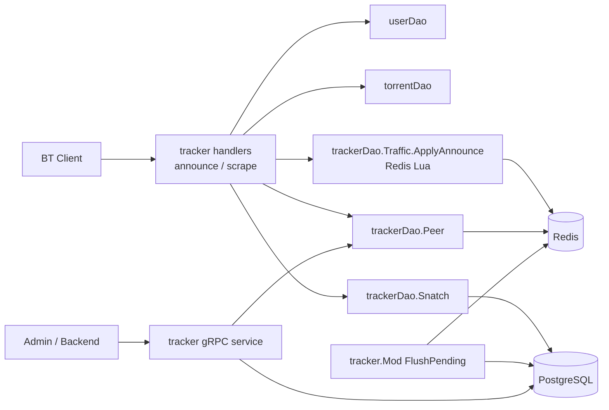
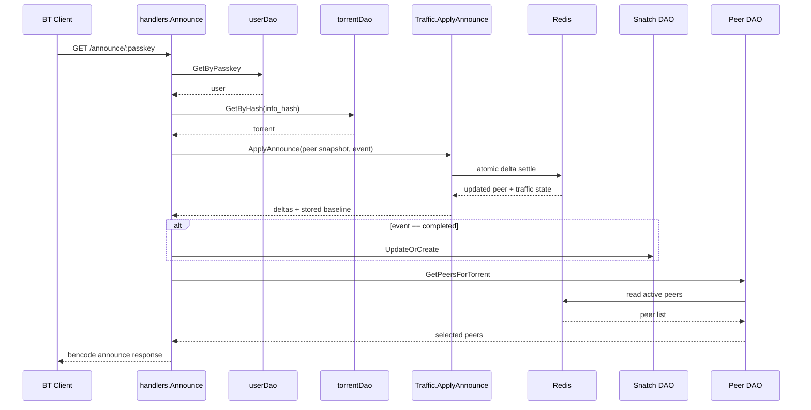
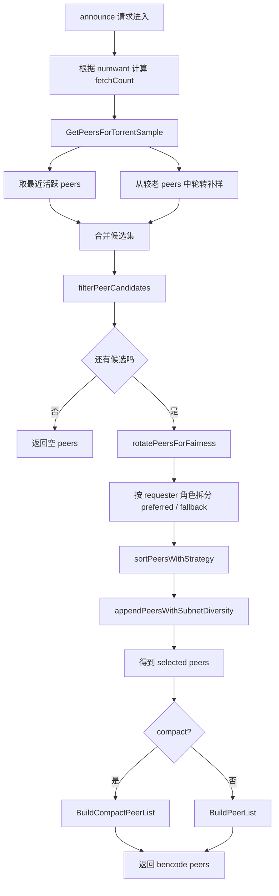
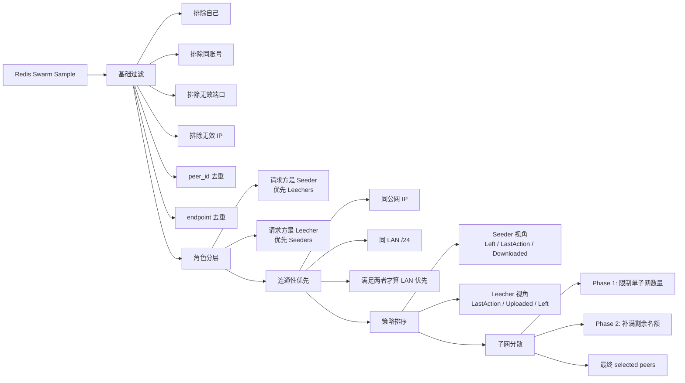
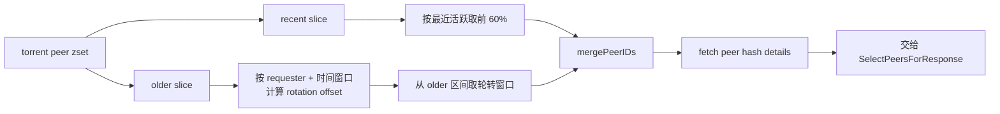

# Tracker

## 概述

`mod/tracker` 负责 BitTorrent Tracker 的接入层和运行时状态管理，主要处理：

- `announce` / `scrape` HTTP 接口
- 活跃 `peer` 的在线状态维护
- 用户、种子维度的流量累计
- 完成下载后的 `snatch` 记录
- 对外的 tracker gRPC 查询接口

这个模块的核心目标不是把所有数据立刻写进数据库，而是先在 Redis 中完成高频、原子的在线结算，再由后台批量落库。

## 目录

- `mod.go`: 模块装配、HTTP 路由注册、流量定时落库任务
- `handlers/`: tracker HTTP 接口实现
- `dao/peer.go`: 在线 peer 的 Redis 读写
- `dao/announce.go`: announce 原子结算脚本
- `dao/traffic.go`: Redis 流量聚合与批量落库
- `dao/snatch.go`: 完成下载后的 DB 记录
- `service/`: tracker gRPC 查询接口
- `model/`: tracker 自身模型

## 架构

### 总体架构图



### 运行时分层

1. `handlers`
   负责协议解析、鉴权、调用 DAO、构造 bencode 响应。
2. `dao`
   负责 Redis/DB 的真实读写，是 tracker 状态机的实现层。
3. `service`
   提供后台查询能力，不参与 announce 实时记账。

### 外部依赖

- `mod/user`: 通过 `passkey` 识别用户
- `mod/torrent`: 通过 `info_hash` 找到种子
- `mod/traffic`: 共用流量统计模型
- `mod/system/setting`: 控制定时落库间隔和批次
- Redis: 在线状态、实时计数、待落库中间态
- PostgreSQL/GORM: 持久化统计和 snatch 记录

### 数据流

```text
BT Client
  -> /announce/:passkey
  -> handlers.Announce
  -> userDao / torrentDao 鉴权与种子定位
  -> trackerDao.Traffic.ApplyAnnounce (Redis Lua 原子结算)
  -> trackerDao.Snatch.UpdateOrCreate (仅 completed)
  -> trackerDao.Peer.GetPeersForTorrent
  -> bencode 响应

Redis 聚合态
  -> tracker.Mod 后台 flush goroutine
  -> trackerDao.Traffic.FlushPending
  -> traffic / user / torrent 相关表
```

### Announce 时序图



## 当前方案技术说明

### 设计目标

当前 tracker 方案围绕三个目标设计：

1. 高频 announce 必须低延迟处理，不能把数据库放在同步热路径上。
2. 同一 peer 的流量结算必须具备原子性，避免并发、乱序、状态丢失导致的双算或漏算。
3. peer 返回结果要在可连接性、分发公平性和实现复杂度之间取得平衡。

### 非目标

当前方案刻意没有追求以下能力：

- 不保证 Redis 丢失后的跨 flush 周期强一致恢复
- 不在 announce 热路径内实时更新所有业务报表字段
- 不实现完整的 IPv6 peer 选择与 compact 编码
- 不在 tracker 内部累计 `SeedTime`

这意味着当前实现更偏向“在线状态机 + 周期性持久化”的工程取舍，而不是“每次 announce 直接事务写库”的强持久化方案。

### 设计原则

- 热路径状态统一先落 Redis
- 单次 announce 的状态变更尽量收敛为一次原子提交
- 持久化采用绝对值覆盖，不依赖重复回放增量
- 选择 peer 时优先保证连通性，再考虑公平性和多样性
- 复杂策略放在 DAO 和选择函数内，HTTP handler 保持协议层职责

### 热路径说明

一次 announce 在当前方案中分成两个阶段：

1. 同步阶段
   在 HTTP 请求生命周期内完成鉴权、种子定位、Redis 原子结算、可选 snatch 记录写入、peer 列表选择和响应返回。
2. 异步阶段
   由后台 flush 任务把 Redis 中的绝对值聚合写回数据库。

同步阶段承担的是“在线事实更新”，异步阶段承担的是“持久化视图收敛”。

### 状态模型

当前方案维护三类运行时状态：

- `peer` 快照
  代表某个 `torrent_id + peer_id` 的当前会话基线，包含累计上传下载值、剩余量、地址信息和最后活跃时间。
- 聚合流量
  分别维护用户维度、种子维度、用户-种子维度的累计绝对值。
- 实时速率桶
  用短窗口 hash 记录最近一分钟的上传下载速率，用于面板展示。

这里的关键点是：`peer` 快照负责 delta 计算基线，聚合流量负责对外统计，二者在 announce 内一起更新。

### 原子结算模型

`Traffic.ApplyAnnounce` 是当前方案的核心。

它通过 Redis Lua 脚本把以下动作合并为单次提交：

- 读取旧 `peer` 快照
- 根据 `uploaded/downloaded/left/event` 计算本次 delta
- 保护基线单调性，避免被旧 announce 回滚
- 回写新的 `peer` 快照
- 更新用户/种子/用户-种子流量绝对值
- 更新实时速率桶
- 标记 dirty 集合，供后台 flush 使用
- 更新 swarm 活跃 peer 索引

这样设计的原因是，announce 本质上是一个“读取旧基线后再写新基线”的状态转换问题。
如果拆成多次 Redis 或 DB 操作，就会暴露在并发竞争和部分成功的中间态之下。

### Delta 语义

当前 delta 语义不是“盲信客户端累计值”，而是“基于旧快照做受约束的增量确认”：

- `started` 可以视为新会话起点
- 非 `started` 的首次 announce 不接受全量补账
- 累计值只允许向前推进，不允许回滚基线
- `completed` 只改变完成状态，不被当作补记全量的可信边界

这个定义的目的，是把客户端计数器的不稳定性限制在会话边界上，而不是污染整条流量链路。

### 持久化策略

数据库不是 announce 的事实来源，而是 Redis 聚合态的周期性持久化结果。

当前做法是：

- Redis 中保存绝对值
- flush 时把绝对值 upsert 到 DB
- 通过 `_version` 避免把仍在变化的 key 过早移出 dirty set

这种方式比“记录一堆待消费增量日志”更容易做幂等覆盖，也更适合 tracker 这类高频、低价值单次请求场景。

### Peer 选择策略

当前 peer 选择不是随机返回所有 peer，而是一个分阶段策略：

1. 候选采样
   先从 Redis zset 中取一部分最近活跃 peer，再从较老 peer 中按请求者和时间窗口做轮转补样。
2. 基础过滤
   去掉自己、同账号 peer、无效端口、无效 IP、重复 peer、重复 endpoint。
3. 角色偏好
   seeder 优先拿 leecher，leecher 优先拿 seeder。
4. 连通性优先
   只有在“同公网 IP 且同 LAN /24”时，才视为更优的局域网候选。
5. 排序和分散
   先按最近活跃和角色相关指标排序，再限制单个子网的集中度。

这个策略的目标不是做最复杂的 swarm 调度，而是在一个轻量实现里兼顾三点：

- 返回尽可能可连通的 peer
- 避免头部热点 peer 被持续重复返回
- 避免同一公网子网过度集中

### 一致性与可靠性取舍

当前方案对一致性的承诺边界如下：

- 单次 announce 在 Redis 内部是原子一致的
- flush 之后，DB 会逐步收敛到 Redis 的绝对值
- Redis 丢失且尚未 flush 的窗口数据，当前无法完全恢复

因此，这是一套“运行时强一致、跨介质最终一致”的方案，而不是“Redis/DB 双写强一致”的方案。

对 tracker 这种吞吐高、请求频繁、统计允许短暂延后收敛的场景，这个取舍是合理的。

### 为什么当前方案是合适的

和直接事务写数据库相比，当前方案有几个现实优势：

- announce 延迟更低
- 数据竞争面更小
- 幂等覆盖更容易做
- 实时速率和在线 peer 状态天然适合驻留 Redis
- 后台统计、后台管理、用户维度报表可以解耦出热路径

代价也很明确：

- 需要接受 Redis 是短期事实来源
- 需要接受 flush 周期内的最终一致性
- 需要维护一套额外的 Redis 状态模型和清理机制

这就是当前 tracker 的工程化设计基线。

## Peer 选择图示

### Peer 选择流程图



### 候选筛选与排序分层图



### 候选采样图



## Announce 技术方案

### 入口流程

`handlers.Announce` 的实时路径如下：

1. 通过 `passkey` 定位用户
2. 解析 `info_hash`、`peer_id`、`uploaded`、`downloaded`、`left`、`event`
3. 提取公网 IP 和可选 LAN IP
4. 组装当前 peer 快照
5. 调用 `trackerDao.Traffic.ApplyAnnounce`
6. 如果 `event == completed`，写入 `snatch`
7. 查询 swarm peers，返回 bencode 列表

对应代码入口：

- `handlers/handler.go`
- `dao/announce.go`

### 为什么要用 Redis Lua

announce 是高频请求，最容易出错的地方是：

- 同一 peer 并发 announce，读到相同旧值导致重复记账
- peer 状态写成功但流量写失败，或者反过来，产生中间态
- `completed` 时快照缺失，错误地把全量累计值再次入账

`ApplyAnnounce` 用一段 Lua 脚本把下面几步合并成一次原子操作：

- 读取上一个 peer 快照
- 计算 upload/download delta
- 更新 peer 当前基线
- 更新用户、种子、用户-种子对的流量聚合
- 更新实时速率桶
- 更新 dirty set，等待后台 flush
- 维护 torrent peer zset

这样可以保证“同一次 announce 的 peer 状态和流量增量”要么一起成功，要么一起失败。

### Delta 计算规则

当前实现遵循以下规则：

1. 首次 announce 且 `event == started`
   直接接受客户端当前累计值，视为新会话起点。
2. 首次 announce 且 `event != started`
   不信任全量累计值，delta 记为 `0`。
3. 已有旧快照且 `current >= previous`
   delta = `current - previous`
4. 已有旧快照但计数器回退
   只有 `event == started` 才接受为新会话；否则不记增量。
5. 非 `started` 场景下，即使收到更小的累计值，也不会把 Redis 中的基线回写成更小值。

第 2 条是这次修复的关键点：`completed` 不再被视为可信的“全量补账边界”。

### 错误处理策略

announce 的关键路径现在是 fail-fast：

- `ApplyAnnounce` 失败：直接返回 tracker failure
- `completed` 时写 `snatch` 失败：直接返回 tracker failure

这样不会再出现“客户端收到了成功响应，但账没有记上”的静默错误。

## Redis 运行时状态

### Peer

- `tracker:peer:v2:{torrent_id}:{peer_id}`
  `peer` 当前快照，使用 hash 存储
- `tracker:torrent_peers:{torrent_id}`
  活跃 peer 集合，使用 zset 按 `last_action` 排序

`peer` 当前存的字段包括：

- 基础身份：`torrent_id`、`user_id`、`peer_id`
- 网络信息：`ip`、`lan_ip`、`port`
- 累计值：`uploaded`、`downloaded`、`left`
- 状态：`is_seeder`、`started_at`、`last_action`

### 流量聚合

- `tracker:traffic:user:{user_id}`
- `tracker:traffic:torrent:{torrent_id}`
- `tracker:traffic:pair:{user_id}:{torrent_id}`

这三类 hash 保存的是 Redis 侧绝对值聚合结果，而不是待应用的增量队列。

### Dirty Set

- `tracker:traffic:dirty:users`
- `tracker:traffic:dirty:torrents`
- `tracker:traffic:dirty:pairs`

后台 flush 会随机抽取 dirty 成员，把 Redis 绝对值写回 DB；写成功后用版本号判断是否可以安全移出 dirty set。

### 实时速率

为了给站点流量面板提供实时采样，Redis 中还维护了按时间桶聚合的短窗口计数：

- `tracker:traffic:realtime:user:{user_id}:upload`
- `tracker:traffic:realtime:user:{user_id}:download`
- `tracker:traffic:realtime:site:upload`
- `tracker:traffic:realtime:site:download`

## 落库策略

`tracker.Mod` 在启动时会启动一个后台 goroutine，按系统设置周期调用 `Traffic.FlushPending`。

默认配置：

- `tracker.flush_interval = 60`
- `tracker.flush_batch_size = 200`

落库目标包括：

- `traffic.user_traffic`
- `traffic.transfer_history`
- `traffic.torrent_stats`
- `user.uploaded` / `user.downloaded`

`snatch` 不走这条异步链路，而是在 `completed` announce 时直接写库。

## 一致性边界

当前设计的强项是“单次 announce 在 Redis 内部原子一致”，解决的是实时双算、乱序覆盖、成功响应但未记账的问题。

当前仍然存在的系统边界：

- Redis 是 flush 之前的运行时事实来源
- flush 周期内如果 Redis 丢失未持久化数据，最后一段窗口仍可能丢账
- announce 响应中的 `complete` / `incomplete` 来自 `GetTorrentSnapshot`（Redis 聚合），与仅读 DB 的视图可能因 flush 间隔略有差异
- `compact=1` 时紧凑 peers 仅包含 **IPv4**（`To4`）；纯 IPv6 peer 需使用字典模式（`compact=0`）

这些是后续可以继续演进的点，但不影响本次 announce 原子记账方案本身。

### 信息采集与 RPC 权限（摘要）

- **`TrafficService.GetTorrentStats`**：与 `GetTorrentPeers` / `ListSnatches` 相同，仅 **全局管理员**或**该种子上传者**。
- **`TrafficService.StreamSiteTraffic`**：仅 **全局管理员**（全站实时速率）。
- **`SystemService.GetSiteStats`**：仅 **全局管理员**；`TotalSeeders` / `TotalLeechers` 为 `torrents.seed_count` / `leech_count` 的 **DB 聚合**（与最后一次 flush 对齐，略滞后于 Redis；语义为各种子槽位之和，**不是**全站唯一 peer 数）。
- **多实例**：多个独立 Redis 若共用同一用户库，flush 会以实例内绝对值覆盖 DB —— 见 `mod/tracker/dao/traffic.go` 包注释；生产上应一站点一 Redis 权威源或拆分库表。
- **Announce 行为**：首次 announce 若 `event` 为空（周期通告）也会与 `started` 一样建立流量基线；未知 `event` 字符串按空事件处理；`stopped` 响应中 **不返回 peers**；**scrape** 单次最多处理 64 个 `info_hash`。

## 部署与安全

- **Passkey 与日志**: `announce` / `scrape` 的 URL 中含 passkey，反向代理与访问日志应脱敏或关闭路径详细日志；代码侧可使用 `handlers.RedactPasskeyInPath` 作为安全日志路径，HTTP 中间件会记录脱敏后的 `path`。
- **可信代理与 IP**: 生产环境建议在 `TrackerV1.TrustedProxyCIDRs` 中配置反向代理网段；仅当 `RemoteAddr` 命中这些 CIDR 时才信任 `X-Forwarded-For`，避免直连客户端伪造 XFF。
- **多站点共用 Redis**: 设置 `TrackerV1.RedisKeyPrefix`（如 `siteA:`），所有 tracker Redis Key 会带此前缀，避免多逻辑站数据混写。
- **gRPC**: `GetTorrentPeers` / `ListSnatches` / `TrafficService.GetTorrentStats` 仅允许**全局管理员**或**该种子的上传者**；`GetSiteStats` / `StreamSiteTraffic` 仅**全局管理员**（见上文「信息采集与 RPC 权限」）。

## 本次修复覆盖的问题

这次方案主要消除三类错误：

1. 关键错误被吞掉，客户端看到成功但记账失败
2. 并发 announce 读取同一旧快照，导致同一段流量被重复累计
3. peer 快照丢失后，`completed` 错误信任全量累计值，导致重复记账

相关实现和测试：

- `dao/announce.go`
- `dao/announce_test.go`
- `handlers/handler_delta_test.go`
