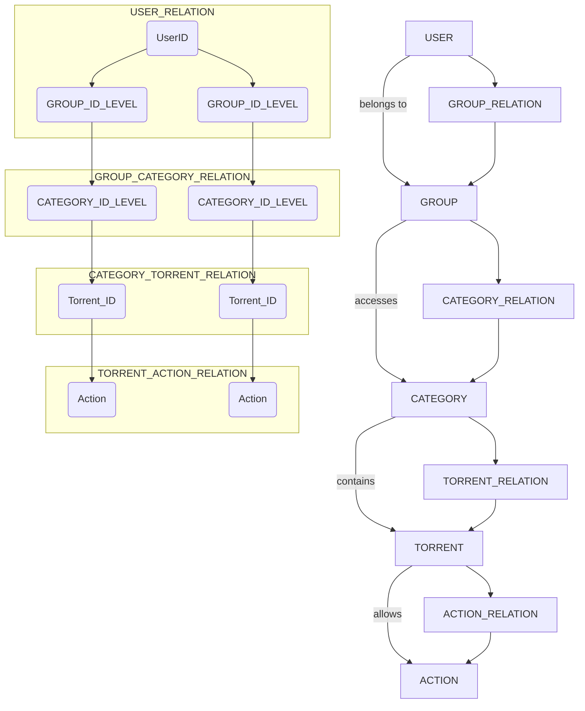

# RBAC 

```
Category:{ID} -> Torrent:{ID} == Action

GROUP:{ID} -> CATEGORY:{ID}

USER:{ID} <-> GROUP:{ID} 
```



```mermaid
graph TD
    USER -->|belongs to| GROUP
    GROUP -->|accesses| CATEGORY
    CATEGORY -->|contains| TORRENT
    TORRENT -->|allows| ACTION

    USER --> GROUP_RELATION
    GROUP_RELATION --> GROUP

    GROUP --> CATEGORY_RELATION
    CATEGORY_RELATION --> CATEGORY

    CATEGORY --> TORRENT_RELATION
    TORRENT_RELATION --> TORRENT

    TORRENT --> ACTION_RELATION
    ACTION_RELATION --> ACTION

    subgraph USER_RELATION
        U1(UserID) --> G1(GROUP_ID_LEVEL)
        U1 --> G2(GROUP_ID_LEVEL)
    end

    subgraph GROUP_CATEGORY_RELATION
        G1 --> C1(CATEGORY_ID_LEVEL)
        G2 --> C2(CATEGORY_ID_LEVEL)
    end

    subgraph CATEGORY_TORRENT_RELATION
        C1 --> T1(Torrent_ID)
        C2 --> T2(Torrent_ID)
    end

    subgraph TORRENT_ACTION_RELATION
        T1 --> A1(Action)
        T2 --> A2(Action)
    end


```