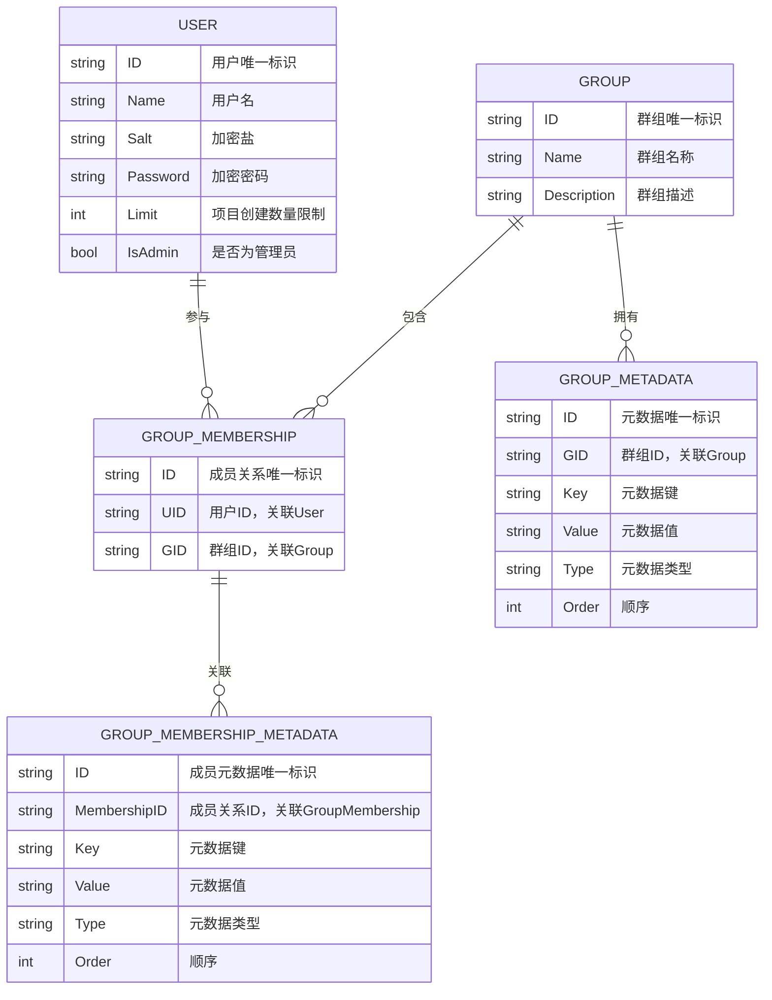

```mermaid
erDiagram
    USER {
        string ID "用户唯一标识"
        string Name "用户名"
        string Salt "加密盐"
        string Password "加密密码"
        int Limit "项目创建数量限制"
        bool IsAdmin "是否为管理员"
    }

    GROUP {
        string ID "群组唯一标识"
        string Name "群组名称"
        string Description "群组描述"
    }

    GROUP_MEMBERSHIP {
        string ID "成员关系唯一标识"
        string UID "用户ID，关联User"
        string GID "群组ID，关联Group"
    }

    GROUP_METADATA {
        string ID "元数据唯一标识"
        string GID "群组ID，关联Group"
        string Key "元数据键"
        string Value "元数据值"
        string Type "元数据类型"
        int Order "顺序"
    }

    GROUP_MEMBERSHIP_METADATA {
        string ID "成员元数据唯一标识"
        string MembershipID "成员关系ID，关联GroupMembership"
        string Key "元数据键"
        string Value "元数据值"
        string Type "元数据类型"
        int Order "顺序"
    }

    USER ||--o{ GROUP_MEMBERSHIP: "参与"
    GROUP ||--o{ GROUP_MEMBERSHIP: "包含"
    GROUP ||--o{ GROUP_METADATA: "拥有"
    GROUP_MEMBERSHIP ||--o{ GROUP_MEMBERSHIP_METADATA: "关联"

```